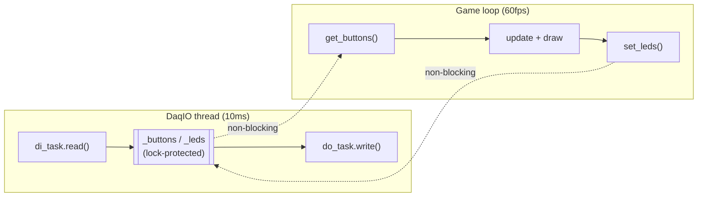

# Two-Player Jetpack Joyride Demo

A two-player, split-screen endless flyer in pygame, played on physical buttons wired to an NI mioDAQ, with automatic keyboard fallback so it runs anywhere.


## What it is

Two players share one screen, one lane each, and race the same randomly-chosen obstacle course until both crash. Holding your button fires a jetpack; letting go drops you. Whoever flies furthest wins, and the top five runs persist to a JSON file between sessions.

It was built during an internship as a hardware-demo piece: the point was to drive a real game loop off live digital I/O rather than a plot window, so the DAQ reads buttons and lights LEDs while the game runs at 60fps. It falls back to the keyboard automatically when no DAQ is present, which is how it was developed and how you'll most likely run it.

## Running it

```
git clone <this repo>
cd internpresentationdemo
pip install -r requirements.txt
python main.py
```

That's it — no DAQ needed. The game prints why it fell back and plays on the keyboard:

```
NI DAQ not available (...Status Code: -201003) -- running in keyboard-only mode.
```

**Keyboard controls**

| Key | Action |
|---|---|
| `SPACE` | Player 1 thrust |
| `UP ARROW` | Player 2 thrust |
| `SPACE` + `UP` held 2s | Start a round from the name screen |
| Type / `TAB` / `ENTER` | Name entry: edit, switch field, start |
| `R` | Return to name entry once both players are down |
| `F11` | Cycle windowed → borderless → fullscreen |
| `ESC` | Quit |

`Shift+Q` between rounds opens a passcode-gated menu whose only action is wiping the saved leaderboard. The passcode is `admin`, hardcoded at [`jetpack/config.py:54`](jetpack/config.py#L54) — it exists so a stray keypress can't clear the board mid-demo, not as a security boundary, and the code says so.

**With hardware**, install the NI-DAQmx driver, set `DEVICE` at [`jetpack/config.py:63`](jetpack/config.py#L63) to match your device name in NI MAX, and run the same command. Buttons then become the *only* input during a round — the keyboard is deliberately ignored so a bystander can't steal control mid-race. Name entry always uses the keyboard, since typing a name on two momentary buttons isn't practical.

## The hardware setup

Developed against an NI mioDAQ. Any NI device exposing digital I/O on `port0` works; only the four line numbers matter.

| Signal | Line | Direction |
|---|---|---|
| Player 1 button | `Dev1/port0/line0` | DI |
| Player 2 button | `Dev1/port0/line1` | DI |
| LED 1 | `Dev1/port0/line6` | DO |
| LED 2 | `Dev1/port0/line7` | DO |

Two momentary pushbuttons on the DI lines, two LEDs (with series resistors) on the DO lines, common ground. Each LED mirrors its player's button while that player is alive, and both light while the hold-to-start meter charges, so the hardware confirms a press registered even before anything happens on screen.

The DO write order is deliberately reversed in code ([`jetpack/daq.py:70-72`](jetpack/daq.py#L70-L72)): `line6` drives LED 2 and `line7` drives LED 1. That isn't a bug — it compensates for how the board was physically wired, confirmed by pressing each button against real hardware. If yours is wired straight through, that swap is the line to remove.

**On simulated devices:** a simulated NI device in NI MAX will connect, create both tasks and run the polling thread, so it's useful for exercising the DAQ code path without hardware. It won't let you play, though — simulated DI lines read a constant, so no button press ever registers. Keyboard mode is the real no-hardware path.

## How it works

### Input: one boolean per player per frame

There is no input-source class hierarchy. The abstraction is narrower and lives in one place: whatever the source, each frame reduces to `thrust`, a list of two booleans, and nothing downstream can tell where they came from.

```python
if daq.available:
    daq_b1, daq_b2 = daq.get_buttons()
    thrust = [daq_b1, daq_b2]
else:
    keys = pygame.key.get_pressed()
    thrust = [keys[key_map[0]], keys[key_map[1]]]
```

`Player.update(dt, thrust_held, scroll_speed)` takes that bool and never learns its origin. Every mechanic built on top — the fuel drain, the press-boost streak that keys off the release→press edge, Profit Bird's discrete flap, Lil' Stomper's jump-then-float — is written against a held/not-held bool, so all of it works identically on a button and on a key. Adding a third input source means producing that pair of bools; it means touching nothing else.

The name screen is the one deliberate exception, accepting DAQ *or* keyboard simultaneously (`(daq_b1 and daq_b2) or (keys[...] and keys[...])`) because there's no round in progress for a bystander to interfere with.

### Keeping the DAQ off the render path

A digital read of two lines is fast, but "fast" isn't "bounded" — a driver hiccup blocking `read()` would stall the frame. So `DaqIO` owns a daemon thread that polls every 10ms and caches the result behind a lock; the game loop only ever reads the cache.



Both directions are non-blocking: `set_leds()` just stores the desired state, and the poll thread writes it on its own next pass. The frame rate is unaffected by how slow the DAQ is, and a DAQ error kills the thread and flips `available` rather than propagating into the game loop. `dt` is separately clamped to 50ms so even a hard stall can't cause a physics jump through an obstacle.

### Race fairness: one course, both lanes

Each `Lane` owns a `random.Random()` that drives *every* spawn position and timing in it. Both lanes get the same seed each round, so the two courses are byte-identical and skill is the only variable. The seed is shown on the game-over screen.

The seed isn't arbitrary. It's drawn from a pool of 20 vetted values, and picking that pool is its own offline problem solved by [`tools/pick_course_seeds.py`](tools/pick_course_seeds.py): it simulates 2000 candidate courses using the game's own `Lane` class at a fixed 60fps and, every frame, measures the largest vertical opening across the player's own column — the slot the player actually has to fit through at that moment, not a property of the course in the abstract. Constrained frames are grouped into obstacle "events", and each seed is scored on obstacle density, how narrow those openings are, and the vertical speed needed to get from one to the next. The five metrics are z-scored before weighting, since they're a count, two pixel measures and two px/s measures.

The pool takes 20 seeds at even percentiles from the 2nd to the 80th of that distribution. The top fifth — the long hard tail that ends a run in seconds — is dropped outright, while a genuine easy-to-hard spread survives. `reset_game()` also excludes the current seed when drawing the next: with only 20 courses, plain `random.choice` repeats back-to-back often enough to look like a bug.

Worth being straight about the limit: this grades *within* a passability guarantee, and it's a proxy for how much precision the geometry demands, not for whether a course is fun.

### Telegraphing, enforced structurally

Every hazard that can arrive without warning gets one, and in each case the warning is safe *by construction* rather than by a flag that could be missed:

- **Straight missiles** show a blinking `!` at the lane's right edge for 1.2s at the exact y the missile will fire from. The `Missile` object isn't constructed until the warning elapses — for the whole window there is nothing in the lane to collide with. `MissileWarning` has no `rect()` and no `collides()`, so there's no surface to hit it through even by mistake.
- **Seeking missiles** blink in place at the right edge for three full on/off cycles before launching, and are excluded from `Lane.hazards()` while `state == "telegraph"`. Once launched they steer toward the player's y with a clamped turn rate, and their vertical speed is capped well under the player's own, so a last-second dodge can always outrun the turn.
- **Zappers** spawn as hand-authored *patterns* rather than one at a time, and every pattern is verified passable before it's accepted: `pattern_is_passable()` sweeps the pattern in 8px columns, merges the vertical spans each beam blocks, and requires an opening of at least 80px (2.5× the player's collision box) in every column. `_spawn()` rerolls up to 8 times, then falls back to a short floor beam that cannot wall the lane off.

That last check earned its keep immediately — it rejected about a third of one pattern's rolls, because the two facing emitter nodes each eat half a node's width out of the gap, leaving an opening authored as 84px only 64px actually free. That's the bug that would have shipped if the guarantee had been left to hand-authored numbers.

Zapper collision is measured against the beam *segment* (`Rect.clipline`), never its bounding box: for a 45° diagonal that box covers roughly twice the area the beam visibly occupies, and dying in visibly empty space reads as a cheat. The beam counts as zero-width while it draws ~16px thick, so the check errs a few pixels in the player's favour.

### Resolution independence

Every frame draws to a fixed 1100×640 surface, and `present()` scales that into the actual window as the very last step, uniformly on both axes with the remainder as letterbox bars. No collision box, spawn coordinate or sprite scale is resolution-aware, and none had to change to support three display modes — `window.get_size()` appears exactly once in the file.

## What I'd do differently

**Split the file sooner.** This lived as a single 2100-line module for twenty of its twenty-one development phases. That was the right call at 400 lines for something meant to be handed around as one file, and the wrong one by about line 1000 — the module boundaries in `jetpack/` were all implied by the code long before they were made explicit, and working inside one file that long made it harder than it needed to be to see them.

**Commit the tests.** Development leaned heavily on headless verification — stepping a `Lane` through 60 in-game seconds under `SDL_VIDEODRIVER=dummy` and asserting on the result — and that caught real bugs the DEVLOG records: missiles drifting backwards once scroll speed outran them, fuel refilling mid-air, coins spawning inside beams. None of those scripts were kept. A reviewer has to take the DEVLOG's word for all of it, which is exactly the wrong tradeoff.

**Record asset provenance at the time, not afterwards.** Two assets in [ASSET-CREDITS.md](ASSET-CREDITS.md) are marked "provenance unverified" purely because nobody wrote down where they came from. That's a two-second note that became unrecoverable.

**Keep generator inputs in the repo.** [`tools/rebuild_manager_sprites.py`](tools/rebuild_manager_sprites.py) documents exactly how the scientist sprites were made and cannot run, because its two source images were never committed. The sprites it produced are therefore unreproducible — and one known bug in them (the "knockdown" frames are cropped from a standing idle, so a knocked-over scientist stands calmly and vanishes) is unfixable without redoing the extraction by hand.

**Finish the explosion VFX.** `draw_explosion` is still an expanding primitive ring, and its docstring has said `PLACEHOLDER` since the day it was added.

## Project layout

```
main.py                   entry point — thin, just calls jetpack.game.main()
jetpack/
  config.py               every tunable constant, data only
  daq.py                  NI DAQ button/LED I/O on a background thread
  entities.py             Player and the objects that live in a lane
  patterns.py             zapper patterns, coin formations, fairness predicates
  lane.py                 one player's world and its spawn timers
  render.py               sprite loading, drawing, canvas-to-window scaling
  scores.py               the persistent leaderboard
  ui.py                   name entry, hold-to-start, admin modal
  game.py                 the loop that ties it together
assets/                   sprites the game loads
  source/                 original sheets and reference art
  unused/                 extracted-but-unused variants, kept for traceability
tools/                    offline scripts: seed selection, sprite generation
docs/ARCHITECTURE.md      how the pieces fit and why
docs/DEVLOG.md            chronological build log, including the wrong turns
ASSET-CREDITS.md          third-party art attribution and licensing scope
```

## License

Source code is MIT ([LICENSE](LICENSE)). **The artwork is not** — most of it is third-party and not mine to relicense. See [ASSET-CREDITS.md](ASSET-CREDITS.md). *Jetpack Joyride* and *Dan the Man* are trademarks of Halfbrick Studios; this project is an unaffiliated, non-commercial homage.
