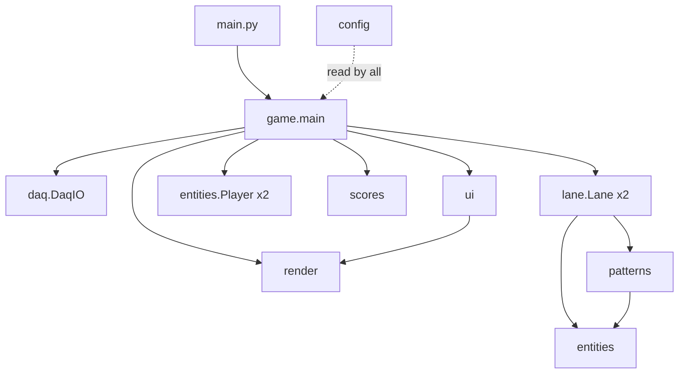

# Architecture

How the pieces fit, and why they're arranged this way. For the chronological story
of how it got here — including the wrong turns — see [DEVLOG.md](DEVLOG.md).

## The shape of the thing



One direction only. `config` is read by everything and imports nothing but `os`;
`game` imports everything and is imported by nothing but the entry point. There are
no cycles, and the dependency edges are the ones you'd draw on a whiteboard.

| Module | Owns |
|---|---|
| `config` | Every tunable constant. Data only — no logic, no classes. |
| `daq` | The NI DAQ, and the background thread that keeps it off the render path. |
| `entities` | `Player` plus the objects that live in a lane. |
| `patterns` | Zapper patterns, coin formations, and the two fairness predicates. |
| `lane` | One player's world: hazard lists and independent spawn timers. |
| `render` | Sprite loading, every `draw_*`, and canvas-to-window scaling. |
| `scores` | The persistent leaderboard. |
| `ui` | Name entry, hold-to-start meter, admin modal. |
| `game` | The loop, the state machine, input routing, collision. |

## Why pygame

The requirement was a game loop driven by live digital I/O on a Windows laptop with
an NI driver stack already installed. That makes the binding constraint *plays
nicely with a foreign blocking API on another thread*, not rendering capability.

pygame is a thin SDL2 wrapper with no opinion about where the main loop lives, no
scene graph, no asset pipeline and no async runtime to fight. A frame is: drain the
event queue, mutate some state, blit, flip. That maps directly onto reading a cached
button state each frame, and it means the DAQ thread and the render thread have
nothing to negotiate beyond one lock.

An engine like Godot or Unity would have supplied a scene system, an asset importer
and a scripting layer, all of which are overhead for a fixed 1100×640 canvas with
sixty sprites — and each of which is another thing that has an opinion about
threading. The two pieces of real engineering here (course-fairness seeding and
non-blocking hardware I/O) are engine-independent, so a heavier engine buys nothing
and costs the ability to run the whole game headless in a test.

Specifically `pygame-ce` rather than `pygame`: on Python 3.14 there is no `cp314`
wheel for upstream pygame, so pip falls back to a source build requiring MSYS2. The
community fork ships the wheel and is API-compatible — a drop-in `import pygame`.

## Why nidaqmx directly, with no wrapper layer

The tempting design is an abstract `InputSource` with `DaqInputSource` and
`KeyboardInputSource` implementations. It was not built, and that's deliberate.

The two sources have almost nothing in common at the API level. `nidaqmx` gives a
task object polled for a *level* on a schedule you choose; pygame gives an event
queue plus a keystate array sampled inside the frame. A base class over those two
would be a base class over one method returning two booleans — an interface whose
entire content is `-> tuple[bool, bool]`.

So the abstraction lives at the value instead of at the type. Once per frame,
`game.main` collapses whichever source is live into `thrust`, a list of two bools:

```python
if daq.available:
    daq_b1, daq_b2 = daq.get_buttons()
    thrust = [daq_b1, daq_b2]
else:
    keys = pygame.key.get_pressed()
    thrust = [keys[key_map[0]], keys[key_map[1]]]
```

Below that line nothing knows a DAQ exists. `Player.update(dt, thrust_held, ...)`
takes a bool. The fuel drain, the press-boost streak, Profit Bird's flap and Lil'
Stomper's float are all written against that bool and all behave identically on
either source.

**This is the boundary.** It is one branch, in one function, in one module. A third
input source (a gamepad, a network client, a replay file) means producing that pair
of booleans and touching nothing else.

One consequence worth noting: a press *edge* — which two of the three control
schemes need — cannot come from the input layer, because the DAQ has no equivalent
of `KEYDOWN`; it only has a level, sampled per frame. So the edge is derived inside
`Player.update` from a `_was_held` field. Putting it there rather than in the input
layer is what keeps the two sources genuinely equivalent instead of merely similar.

## The hardware boundary

`daq.DaqIO` is the only object in the codebase that touches hardware, and it
guarantees two things to everything above it:

**1. It never blocks a frame.** A daemon thread polls DI and writes DO every 10ms.
The game loop reads a lock-protected cache and writes desired LED state into
another. The lock is held only across two list assignments, never across a driver
call — holding it over `read()` would hand the game loop exactly the stall the
design exists to prevent. Cost: up to 10ms of LED latency, invisible in practice.

**2. It always presents a working interface.** Missing package, missing device, or a
driver error mid-run all end the same way: `available` goes False and every method
becomes a no-op. There is no hardware error path for callers to handle, because the
only sensible response — use the keyboard — is already the fallback.

`dt` is separately clamped to 50ms in the loop, so even a hard stall from any source
cannot produce a physics step large enough to tunnel a player through a hazard.

## The fairness guarantees

Two properties are enforced structurally rather than by discipline, and they're the
parts worth talking about.

**Both players race the same course.** Every spawn position and timing in a `Lane`
is drawn from `self.rng`, a `random.Random` the lane owns outright — never the
global `random` module, which anything else in the process could perturb. Seeding
two lanes identically therefore makes their courses byte-identical, and skill is the
only variable left. That's one seed passed to two `reset()` calls.

The seed itself comes from a pool of 20 vetted values rather than the full 2³¹
space, chosen offline by [`tools/pick_course_seeds.py`](../tools/pick_course_seeds.py).
That tool imports the game's own `Lane` and simulates candidates headless — which is
only possible because `Lane.update()` takes the player's y as a parameter instead of
holding a `Player` reference. Keeping that coupling out bought the ability to
difficulty-test courses with no player and no window.

**Every course is flyable.** `patterns.pattern_is_passable` sweeps a candidate
pattern in 8px columns, merges the vertical spans each beam blocks, and rejects the
pattern unless every column leaves an 80px opening. `Lane._spawn` re-rolls up to
eight times, then falls back to a short floor beam that cannot wall the lane off by
construction.

This is a guarantee about per-column clearance, not path connectivity — proving a
route exists would mean pathfinding against the player's climb rate. Per-column
clearance is the weaker claim, and it is the one that catches the failure that
actually matters.

## Telegraphing as a structural property

Every hazard that could arrive unannounced is warned, and in each case the warning
is safe *by construction* rather than by a flag someone must remember to check:

- A `MissileWarning` is not a missile with a `dangerous=False` field. The `Missile`
  object is not constructed until the warning elapses, and `MissileWarning` has
  neither `rect()` nor `collides()`. There is no surface through which it could be
  hit even by a bug.
- A telegraphing `SeekingMissile` is excluded from `Lane.hazards()` by state, and
  `hazards()` is the single generator feeding the kill check.
- Scientists are excluded from `hazards()` entirely, because they are a reward.
  Their docstring says so, specifically so it doesn't get "helpfully" fixed later.

`Lane.hazards()` yielding *objects* rather than rects is what keeps the kill check
one call site: a zapper is a line segment and a missile is a box, so each tests
itself and `game.main` stays `any(h.collides(p_rect) for h in lane.hazards())`.

## Rendering and resolution

Every frame draws to a fixed 1100×640 surface. `render.present()` scales that into
the actual window as the last act of the frame, uniformly on both axes with the
remainder as letterbox bars.

The payoff is that no game code is resolution-aware — not one collision box, spawn
coordinate or sprite scale. Three display modes were added without touching a single
gameplay constant. `window.get_size()` appears exactly once in the package, inside
`present()`.

`render` also never mutates game state: every function takes a surface and something
to draw. That's what makes the headless testing the project leaned on possible — a
`Lane` steps for sixty simulated seconds with no display, because the update path
never enters this module.

## Known structural weaknesses

Being straight about the parts that are not good:

- **`game.main` is ~450 lines** holding all loop state in locals with closures over
  them. It gives one place to look for what the game is doing, at the cost of
  testability: the DEVLOG's end-to-end tests had to wrap module-level draw functions
  to observe which screen was live, because no state is reachable from outside.
- **`from .config import *`.** A star import, chosen so the split could be verified
  as behaviour-preserving and so physics code reads `GRAVITY` rather than
  `config.GRAVITY`. `config` is provably side-effect-free and defines `__all__`, but
  it's still a star import and a reviewer is entitled to dislike it.
- **No committed tests.** Development leaned heavily on headless verification that
  caught real bugs — none of those scripts were kept. This is the biggest gap.
- **`DaqIO.close()` leaks its tasks** if the poll thread died mid-run; the early
  return on `not available` skips the cleanup. Documented in its docstring.
